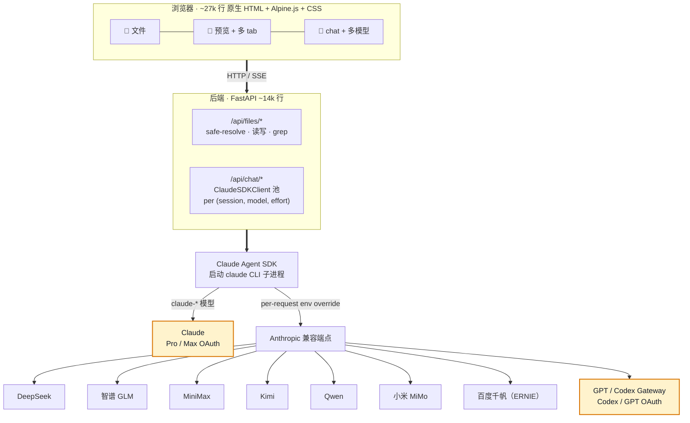

# 架构

> [English](architecture.md)



## 关键设计决策

- **SDK 而非 raw API。** 用 Claude Agent SDK（Claude Code 同款引擎），MCP / Skills / Subagent / plan 模式 / `CLAUDE.md` 自动加载跨厂商行为一致。接入新提供商见 [add-provider_zh.md](add-provider_zh.md)。

- **会话级 env 覆盖。** 第三方提供商通过设置 `ANTHROPIC_BASE_URL` + `ANTHROPIC_API_KEY` + 隔离的 `CLAUDE_CONFIG_DIR`（[`backend/endpoints.py:L851`](../backend/endpoints.py#L851)）接入。最后一项防止 CLI 静默回退到 Pro OAuth 并将第三方流量计入 Anthropic 账单 —— 完整机制详见[模型路由 § env 注入](routing_zh.md#3-第三方环境注入env-injection)。

- **无构建步骤。** 改 `frontend/` 后刷新浏览器即可。审过的第三方库在 `vendor/`（许可证见 [THIRD_PARTY_LICENSES.md](../THIRD_PARTY_LICENSES.md)），安装不涉及 npm。

- **客户端按 `(session_id, model, effort)` 缓存**（[`backend/chat.py:L303`](../backend/chat.py#L303)）。切换模型或推理强度（effort）各自命中独立 client；每条助手消息存自己的 `model` 字段，刷新后气泡标识仍准确。池上限与 LRU 规则见[模型路由 § 客户端池](routing_zh.md#2-客户端池client-pool)。

- **整文件作为输入单元。** `MUSELAB_ROOT` 指向用户自有目录，根级 `CLAUDE.md` 每次对话自动加载。助手通过 Read / Grep / Edit 工具按需访问，不预先向量化。

## 目录地图

运行时有两个根目录：**仓库**（代码 + 每个安装实例的状态）和 **归档**（`MUSELAB_ROOT`，你自己的文件）。两者刻意分开，所以你备份或迁移数据时不必动安装本身。

```
muselab/                      # 仓库根目录
├── backend/                  # FastAPI 应用（约 14k 行）
│   ├── main.py               # app 工厂、uvicorn 入口、路由挂载
│   ├── auth.py               # X-Auth-Token 鉴权（header 或 ?token=）
│   ├── chat.py               # /api/chat/* —— SDK client 池、SSE 回合循环
│   ├── endpoints.py          # provider 目录 + 按请求注入 env
│   ├── files.py              # /api/files/* —— safe-resolve 读写 grep
│   ├── sessions.py           # 会话索引 + sidecar + 队列（repo/sessions/）
│   ├── scheduler.py          # asyncio 定时循环 → <archive>/.muselab/scheduler.json
│   ├── push.py               # Web Push / VAPID → <archive>/.muselab/
│   ├── api_settings.py       # /api/settings —— 热更新 .env + os.environ
│   └── prompts.py            # 系统 prompt 组装
├── frontend/                 # 原生 HTML + Alpine.js + CSS（约 27k 行，无构建）
│   ├── index.html  app.js  styles.css
│   ├── i18n/                 # 中英 UI 文案
│   └── vendor/               # 审过的第三方库（见 THIRD_PARTY_LICENSES.md）
├── scripts/                  # 安装 / 升级 / 卸载 / doctor / https
├── skills/                   # 内置 Claude skills
├── docs/                     # 当前目录
├── .env                      # ← 每个实例的配置 + 密钥（已 gitignore）
└── sessions/                 # ← 会话元数据、sidecar、队列（已 gitignore）

$MUSELAB_ROOT/                # 归档 —— 你的文件，永远在仓库之外
├── CLAUDE.md                 # 每次对话自动加载
├── health/ work/ money/ …    # 你自己建的任意子目录
└── .muselab/                 # scheduler.json · vapid.json · push_subs.json
```

实际的对话记录归 Claude CLI 所有，不在 muselab 里：它们存在 `~/.claude/projects/<cwd-key>/<session-id>.jsonl`。muselab 的 `sessions/` 只保存叠加在上面的元数据（会话名、每条消息的模型标识、成本、上传的附件）。完整备份清单见 [数据与备份](data-and-backup_zh.md)。

## 一个请求的完整链路

一次对话回合就是一条服务器发送事件（SSE）流：

1. **浏览器 → 后端。** `GET /api/chat/stream`，将 prompt、session id 和选定的 `model` 作为查询参数传入（[`backend/chat.py:L5043`](../backend/chat.py#L5043)）。鉴权 token 以 `?token=` 形式传递，因为 `EventSource` 无法设置 header（见[安全模型 § 鉴权](backend-security_zh.md#鉴权)）。
2. **模型解析与锁定。** 会话锁定到单一模型（`sessions.py`）。首回合锁定，后续回合复用它，所以一段对话永远不会中途混用厂商（跨厂商的 *thinking signature* 不通用）。在任何 provider 配置之前建的会话，会在首次真正发送时自动适配到一个已配置的模型。
3. **Client 池。** `chat.py` 按 `(session_id, model, effort)` 取或新建一个 `ClaudeSDKClient`。第三方模型会设置 `ANTHROPIC_BASE_URL` + `ANTHROPIC_API_KEY` + 一个**隔离的** `CLAUDE_CONFIG_DIR`，防止 CLI 回退到你的 Pro OAuth、把费用误计到错误账户。
4. **Agent 循环。** SDK 启动 `claude` CLI 子进程，以你的归档作为工作目录跑完整循环 —— 工具调用（Read/Grep/Edit/Bash）、MCP server、skills、plan 模式。
5. **后端 → 浏览器（SSE）。** token、工具调用事件、最后一个 `done` 事件流式返回。回合通过 `TurnBroadcast` 广播，浏览器断连不会杀掉回复 —— 重连后会回放缓冲区（[模型路由 § SSE 回合循环](routing_zh.md#4-sse-回合循环)）。前端增量渲染；每条助手消息记录自己的 `model`，刷新后气泡标识仍准确。
6. **持久化。** CLI 把对话追加到它的 JSONL；muselab 写 sidecar（成本、模型、附件）。若回合较长且配了 Web Push，完成时即使标签页关闭也会推送通知。

定时任务（见 [定时任务](scheduler_zh.md)）从第 3 步起走同一条链路，只是没有人 —— 它们以完整权限集无人值守运行。

## 深入了解

本页是全局地图。每个子系统都有独立页面，附带源码链接：

| 页面 | 内容 |
|---|---|
| [模型路由与对话循环](routing_zh.md) | 模型解析、客户端池、env 注入、每种 SSE 事件类型 |
| [会话内部机制](backend-sessions_zh.md) | 索引、sidecar、消息队列、附件、fork、重启恢复 |
| [Files API](backend-files_zh.md) | 所有 `/api/files/*` 端点、`safe_resolve`、回收站 |
| [安全模型](backend-security_zh.md) | 鉴权、settings 暴露面、计费隔离、已知局限 |
| [前端内部机制](frontend_zh.md) | 无构建 SPA、渲染管线、SSE 客户端、i18n、service worker |
| [Skills](skills_zh.md) | 内置 skills、发现机制、自定义添加 |
| [基础设施](infrastructure_zh.md) | scripts、systemd/launchd、Docker、测试、CI/CD |
| [术语表](glossary_zh.md) | muselab 所有专有术语的统一定义 |
