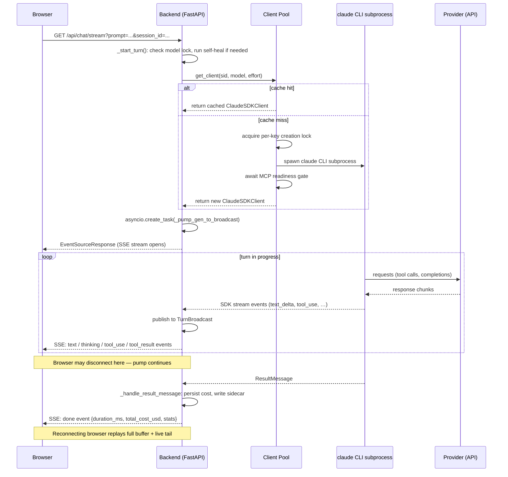

# Model Routing and the Chat Turn Loop

> [简体中文](routing_zh.md)

This document covers how muselab resolves which model a session uses, how it
manages a pool of SDK client subprocesses, how third-party providers receive
their credentials, and how a single chat turn flows from browser to provider
and back as a Server-Sent Events stream.

Related reading: [providers.md](providers.md), [add-provider.md](add-provider.md),
[architecture.md](architecture.md), [configuration.md](configuration.md).

---

## 1. Model Resolution

### Three-tier fallback

When a new session is created, [`_resolve_default_model`](../backend/chat.py#L1639)
picks the model using a three-tier cascade:

1. **Requested model** — the id the frontend sends. Used only if its provider
   is in [`available_groups()`](../backend/endpoints.py#L946) (API key present,
   provider not disabled). Honoring an unusable preference would 401 on every
   send.
2. **`MUSELAB_MODEL` env** (`settings.MODEL`) — same availability check.
3. **First model from the first available group** — covers fresh installs where
   only one provider key is set.
4. If nothing is configured: returns the `MODEL` constant when
   `allow_fallback=True`, or `""` when `allow_fallback=False`.

Session creation always passes `allow_fallback=False`
([`chat.py:L1719-L1724`](../backend/chat.py#L1719-L1724)). A brand-new session
gets an empty model field rather than being hard-locked to the Claude constant,
so it does not 401 forever when the user has configured only a third-party
provider.

### Session model lock

At the start of every turn, [`_start_turn`](../backend/chat.py#L5592-L5606)
reads the session's stored `model` field. **If non-empty, that value wins over
whatever the frontend dropdown currently says** (`model_to_use = locked`). This
prevents cross-vendor thinking-signature corruption: a thinking block signed by
one provider cannot be replayed to a different provider's endpoint.

### Legacy-session self-heal

A session created before any provider was configured gets locked to the
`MODEL` constant (for example, `claude-sonnet-4-6`). Once the user later
configures only DeepSeek, every send fails Anthropic auth.

[`_heal_unreachable_locked_model`](../backend/chat.py#L1680) re-resolves the
model when **both** conditions hold:

- The locked model's provider is **not** in `available_groups()`.
- The session has **no on-disk JSONL** (`_find_session_jsonl() is None`) — it
  has never run a turn, so there are no prior thinking signatures that a vendor
  switch could corrupt.

A session that has run at least one turn is never re-resolved
([`chat.py:L1707-L1714`](../backend/chat.py#L1707-L1714)).

---

## 2. The Client Pool

### Cache key and capacity

Each `ClaudeSDKClient` is keyed by `(session_id, model, effort)`
([`chat.py:L303`](../backend/chat.py#L303),
[`chat.py:L1317`](../backend/chat.py#L1317)). **Permission mode is not part of
the key** — it can be updated in-place via `set_permission_mode()` without
spawning a new subprocess.

The pool cap defaults to **3** clients and is configurable via
`MUSELAB_CLIENT_POOL_CAP`
([`chat.py:L473`](../backend/chat.py#L473)). Each CLI subprocess holds roughly
30-50 MB RSS; the cap prevents unbounded memory growth as users open more
sessions.

### Cache hit (fast path)

Under `_lock` (an `asyncio.Lock`), the pool checks `_clients[key]`
([`chat.py:L1318-L1349`](../backend/chat.py#L1318-L1349)). On a hit the LRU
list is updated. If the cached client's permission mode differs from the
request, `set_permission_mode()` is called **outside** `_lock` (it can take
seconds) and the shared `_bypass_state` dict is flipped to match.

### Cache miss (slow path)

([`chat.py:L1351-L1427`](../backend/chat.py#L1351-L1427))

1. Acquire a **per-key creation lock** (`_creation_lock_for(key)`) so two
   concurrent misses on the same key cannot spawn two subprocesses.
2. **Double-checked locking**: re-read `_clients[key]` under `_lock` in case a
   sibling coroutine built it while we waited.
3. Call `_build_and_connect_client()` — spawns the CLI subprocess and calls
   `client.connect()`.
4. **MCP readiness gate**: if any external MCP server is configured, wait for
   the tool-set to stabilize (two consecutive polls with an identical,
   non-empty, non-pending set) before returning the client
   ([`chat.py:L1367-L1377`](../backend/chat.py#L1367-L1377)). This prevents
   the thinking-block wedge bug caused by MCP connectors arriving
   mid-first-turn.
5. Commit under `_lock`; run LRU eviction if `len > cap`.

### LRU eviction rules

([`chat.py:L1389-L1418`](../backend/chat.py#L1389-L1418))

An entry is **not evictable** while:

- Its session has a non-done `TurnBroadcast` in `_active_turns` (live stream in
  progress).
- Its session id is in `_sessions_with_inflight_tasks` (SDK background task
  still running — disconnecting kills the subprocess and aborts the task).

If every cached client is currently live, the pool is allowed to exceed its cap
temporarily rather than kill an in-progress reply.

### `disconnect_client`

[`chat.py:L1431-L1452`](../backend/chat.py#L1431-L1452) removes all keys for a
session from every pool dict under `_lock`, then calls `await c.disconnect()`
outside the lock. Triggered by: session delete, system-prompt change,
effort/thinking change, cross-provider model switch.

---

## 3. Third-Party Env Injection

### The env dict

[`env_override(model)`](../backend/endpoints.py#L851) in `backend/endpoints.py`
builds a **complete env replacement** (not a merge) for the CLI subprocess. It
returns `None` for Claude/Anthropic models; for every other provider it
returns:

**Forwarded from `os.environ` (allowlist only):**

```
PATH  HOME  USER  LOGNAME  SHELL  TERM  TMPDIR
LANG  LC_ALL  LC_CTYPE
HTTP_PROXY  HTTPS_PROXY  ALL_PROXY  NO_PROXY  (and lowercase variants)
SSL_CERT_FILE  SSL_CERT_DIR  REQUESTS_CA_BUNDLE  NODE_EXTRA_CA_CERTS
XDG_RUNTIME_DIR  XDG_CONFIG_HOME  XDG_CACHE_HOME
```

**Always injected:**

```
ANTHROPIC_BASE_URL       = <resolved vendor endpoint>
ANTHROPIC_API_KEY        = <vendor key>   # x-api-key header
ANTHROPIC_AUTH_TOKEN     = <vendor key>   # Authorization: Bearer (belt-and-suspenders)
CLAUDE_CODE_OAUTH_TOKEN  = ""             # kill OAuth fallback
CLAUDE_OAUTH_TOKEN       = ""             # kill OAuth fallback
CLAUDE_CONFIG_DIR        = <isolated temp dir>
```

**Conditionally injected:**

```
CLAUDE_CODE_MAX_OUTPUT_TOKENS = <cap>   # only when provider.max_output_tokens is set
```

### Why both `ANTHROPIC_API_KEY` and `ANTHROPIC_AUTH_TOKEN`

([`endpoints.py:L857-L865`](../backend/endpoints.py#L857-L865))

`ANTHROPIC_API_KEY` is sent as the `x-api-key` header that third-party vendors
require. `ANTHROPIC_AUTH_TOKEN` is sent as `Authorization: Bearer`. Setting
only `AUTH_TOKEN` triggers the CLI's OAuth fallback path, which routes the
request silently to `api.anthropic.com` and bills it as Claude — the symptom
is `$0.30/msg` cost while using DeepSeek. Both must be set; the CLI ignores
`AUTH_TOKEN` when `API_KEY` is also present.

### Why `CLAUDE_CONFIG_DIR` isolation prevents OAuth fallback billing

([`endpoints.py:L877-L887`](../backend/endpoints.py#L877-L887))

The Claude CLI **prefers** `~/.claude/.credentials.json` (Pro OAuth) over
`ANTHROPIC_API_KEY`. For a third-party vendor, this would cause the CLI to send
your Pro OAuth token to, say, DeepSeek — which returns 401 "invalid api key",
and the CLI then silently retries against `api.anthropic.com`.

The fix: `CLAUDE_CONFIG_DIR` is pointed at a per-OS-user isolated directory
(`$(tmpdir)/muselab-vendor-cli-config-<uid>/`) that contains no
`.credentials.json`. Any leaked credentials file is explicitly unlinked on each
call. This directory is **per-uid** to avoid `PermissionError` on multi-user
installs (an earlier single shared path at `/tmp/muselab-vendor-cli-config`
caused 504s for the second user).

### Why a minimal allowlist, not `os.environ` passthrough

([`endpoints.py:L893-L910`](../backend/endpoints.py#L893-L910))

The SDK hands this dict to the CLI subprocess as a full env replacement. The
subprocess is an internet-capable agent that often runs under
`bypassPermissions`. Inheriting the full environment would leak `MUSELAB_TOKEN`
and every other provider's `*_API_KEY` to a process that could exfiltrate them
via shell commands. The allowlist passes only what the subprocess needs: process
basics, proxy/TLS vars, and the injected vendor credentials.

---

## 4. The SSE Turn Loop

### Endpoint signature

[`GET /api/chat/stream`](../backend/chat.py#L5043-L5051)

| Parameter | Required | Notes |
|---|---|---|
| `prompt` | no | URL-encoded. Empty = reconnect mode. |
| `token` | yes | Auth token as query param (EventSource cannot set headers). |
| `session_id` | yes | UUID of the session. |
| `model` | no | Overridden by the session lock at turn start. |
| `permission` | no | Default `bypassPermissions`. |
| `image_ids` | no | Comma-separated ids from `/upload-image`. |

Response: `text/event-stream` with `Cache-Control: no-cache, no-transform` and
`X-Accel-Buffering: no`
([`chat.py:L5011-L5015`](../backend/chat.py#L5011-L5015)).

### Reconnect vs new-turn mode

([`chat.py:L5058-L5093`](../backend/chat.py#L5058-L5093))

- **Reconnect**: empty `prompt` and no `image_ids` → subscribe to the existing
  `TurnBroadcast` in `_active_turns[sid]`. If not present, check
  `_recent_turns` (grace-keep TTL controlled by `MUSELAB_RECENT_TURN_TTL`,
  default 60 s). If still absent, yield a single `error` event "no active
  turn."
- **Image-only turn**: empty `prompt` with `image_ids` set → treated as a new
  turn; `prompt` is replaced with `"(image)"`.
- **New turn**: non-empty `prompt` → `_start_turn()`.

### `TurnBroadcast`: survive-disconnect design

([`chat.py:L319-L413`](../backend/chat.py#L319-L413))

`_pump_gen_to_broadcast()` runs as a detached `asyncio.create_task`. It
**publishes** every SSE event into a `TurnBroadcast` object. HTTP subscribers
call `_subscribe_broadcast(broadcast)`, which:

1. **Replays** the full `broadcast.events` buffer (all events since turn start).
2. Streams new events from a per-subscriber `asyncio.Queue`.
3. Stops when the sentinel `None` is received (turn done).

**Browser disconnect does not stop the pump.** The turn completes to disk
regardless. A reconnecting browser becomes a new subscriber and receives the
full reply via replay plus live tail. Finished broadcasts are kept in
`_recent_turns` for the grace-keep TTL
([`chat.py:L436-L468`](../backend/chat.py#L436-L468)).

The background pump has a hard timeout of 30 minutes (`BG_TIMEOUT_S = 1800`,
[`chat.py:L6617`](../backend/chat.py#L6617)).

### SSE event types

All events have the shape `{"event": "<type>", "data": "<json-string>"}`.

| Event | Emitted by | When / meaning |
|---|---|---|
| `text` | `_handle_stream_event`, `_handle_assistant_message` | Each text delta; tail-emit if AssistantMessage has chars not yet streamed. |
| `thinking` | `_handle_stream_event` | Each thinking delta (extended thinking enabled). |
| `tool_use` | `_handle_assistant_message` | Each `ToolUseBlock` in an `AssistantMessage` — name, summary, input. |
| `tool_result` | `_handle_user_message` | Each `ToolResultBlock` in a `UserMessage` — preview, error flag. |
| `task_started` | `_handle_user_message`, `_handle_task_message` | Bash `run_in_background` launch or `TaskStartedMessage` from SDK. |
| `task_progress` | `_handle_task_message` | `TaskProgressMessage` — last tool name, running usage. |
| `task_notification` | `_handle_user_message`, `_handle_task_message` | Background task terminal status (in-turn or cross-turn). |
| `rate_limit` | `_handle_rate_limit` | `RateLimitEvent` from SDK — utilization, reset time (Pro/Max only). |
| `done` | `_handle_result_message` | Turn complete — duration, cost, token stats, session usage. |
| `cancelled` | pump error handler | Turn interrupted by user; emitted instead of `error`. |
| `error` | pump error handler | Any exception — `kind` in `{auth, quota, network, cross_vendor, session, sdk, unknown}`, `cta` hint for the UI. |
| `ask_user_question` | MCP side-channel | muselab MCP server asking the user a question mid-turn. |
| `permission_request` | MCP side-channel | Tool permission prompt requiring user approval. |
| `ping` | sse-starlette | Heartbeat every ~15 s; named event so the frontend can detect stalled connections. |

Sources: [`chat.py:L5886-L5904`](../backend/chat.py#L5886-L5904),
[`chat.py:L5906-L6010`](../backend/chat.py#L5906-L6010),
[`chat.py:L6012-L6086`](../backend/chat.py#L6012-L6086),
[`chat.py:L6088-L6163`](../backend/chat.py#L6088-L6163),
[`chat.py:L6165-L6174`](../backend/chat.py#L6165-L6174),
[`chat.py:L6176-L6509`](../backend/chat.py#L6176-L6509),
[`chat.py:L4510-L4572`](../backend/chat.py#L4510-L4572).

---

## 5. Reasoning Effort and Extended Thinking

### Effort in the cache key

Effort is stored per-session and read at turn start
([`chat.py:L5609-L5610`](../backend/chat.py#L5609-L5610)). Because effort is
part of the pool cache key `(session_id, model, effort)`, two browser tabs with
different effort levels on the same session each get their own CLI subprocess
with the correct setting baked in. Changing effort via
`PATCH /sessions/{sid}` calls `disconnect_client(sid)` so the next turn
rebuilds ([`chat.py:L3010-L3026`](../backend/chat.py#L3010-L3026)).

Valid values (sourced from the SDK's own `EffortLevel` literal,
[`chat.py:L62-L66`](../backend/chat.py#L62-L66)):
`"low"`, `"medium"`, `"high"`, `"xhigh"`, `"max"`. Empty string uses the SDK
adaptive default.

### `budget_tokens` and `display="summarized"`

([`chat.py:L1041-L1060`](../backend/chat.py#L1041-L1060))

When extended thinking is enabled, muselab passes:

```python
ThinkingConfigEnabled(type="enabled", budget_tokens=10000, display="summarized")
```

`budget_tokens` defaults to 10 000 and is tunable via `MUSELAB_THINKING_BUDGET`.
`display="summarized"` is **required** for Opus 4.7 and later: without it those
models default to `display="omitted"` (signature only, no plaintext), which
produces empty thinking blocks in the frontend.

### Per-provider thinking and effort support

`supports_thinking` is resolved as
`(provider is None or provider.supports_thinking) and thinking_pref`
([`chat.py:L1049`](../backend/chat.py#L1049)):

- `provider is None` means Claude/Anthropic — always enabled.
- Third-party providers: the `Provider.supports_thinking` field in
  [`backend/endpoints.py`](../backend/endpoints.py). Baidu Qianfan and Codex
  Gateway set this to `False`; other built-ins default to `True`.
- Per-session opt-out: `PATCH /sessions/{sid}` with `thinking=false` is the
  escape hatch for the "thinking blocks cannot be modified" 400 error that
  occurs with certain tool-use interleaving patterns.

Effort exposure is gated separately by `supports_effort` in `/api/chat/providers`.
Claude models always expose the selector. Third-party providers default to
`False`; Codex Gateway opts in, so the frontend shows `low` / `medium` / `high`
/ `max` for `codex:*` while keeping `xhigh` Opus-only. On send, muselab passes
the selected value as `ClaudeAgentOptions.effort`; the Codex sidecar is
responsible for translating that Anthropic-compatible request field to the
Codex/OpenAI backend's reasoning-effort parameter.

---

## Sequence: one chat turn end-to-end


