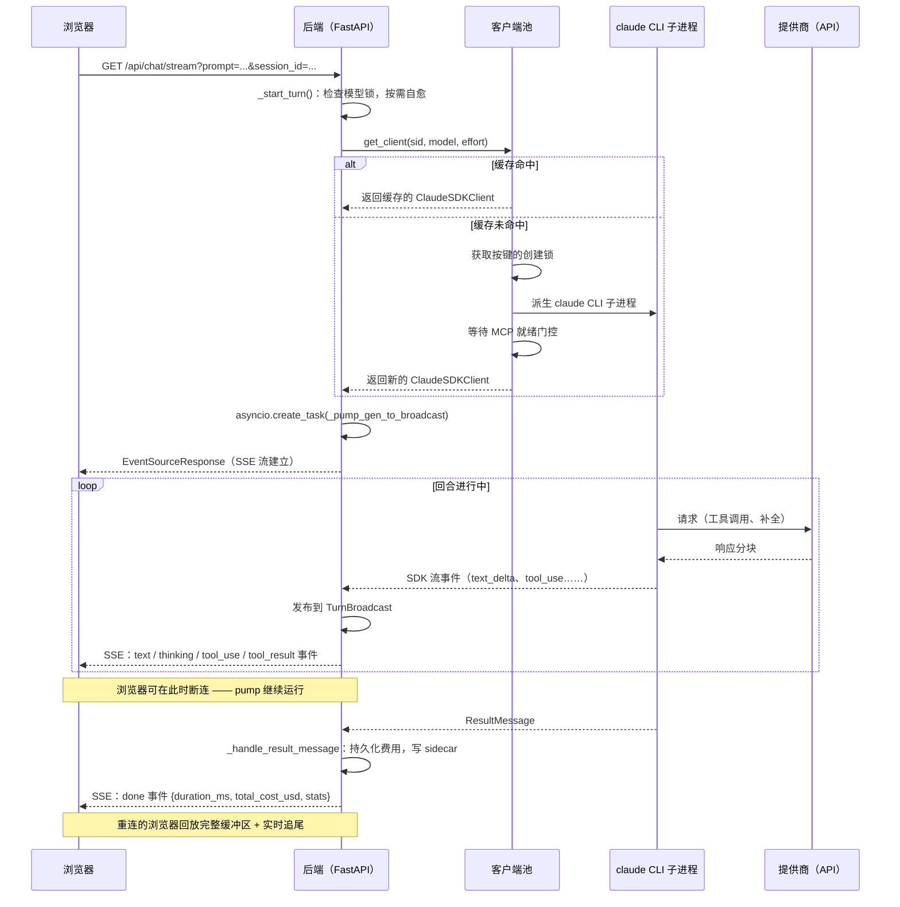

# 模型路由与对话回合循环

> [English](routing.md)

本文介绍 muselab 如何解析会话使用的模型、如何管理 SDK 客户端子进程池、第三方提供商如何获取凭据，以及单次对话回合如何以服务器发送事件（SSE）流的形式在浏览器与提供商之间流转。

相关文档：[providers_zh.md](providers_zh.md)、[add-provider_zh.md](add-provider_zh.md)、[architecture_zh.md](architecture_zh.md)、[configuration_zh.md](configuration_zh.md)。

---

## 1. 模型解析

### 三级回退

新建会话时，[`_resolve_default_model`](../backend/chat.py#L1639) 通过三级级联选取模型：

1. **请求指定的模型** —— 前端发送的模型 ID。仅当其提供商在 [`available_groups()`](../backend/endpoints.py#L946) 中（API 密钥存在且提供商未禁用）时才使用。若接受不可用的偏好，每次发送都会返回 401。
2. **`MUSELAB_MODEL` 环境变量**（`settings.MODEL`）—— 同样做可用性检查。
3. **第一个可用分组的第一个模型** —— 适用于只配置了一个提供商密钥的全新安装。
4. 若什么都未配置：`allow_fallback=True` 时返回 `MODEL` 常量，`allow_fallback=False` 时返回 `""`。

会话创建时始终传入 `allow_fallback=False`（[`chat.py:L1719-L1724`](../backend/chat.py#L1719-L1724)）。全新会话的模型字段为空，而非锁定到 Claude 常量，这样在用户只配置了第三方提供商时就不会一直返回 401。

### 会话模型锁定

每个回合开始时，[`_start_turn`](../backend/chat.py#L5592-L5606) 读取会话存储的 `model` 字段。**若该字段非空，则不管前端下拉框当前选中什么，都以该值为准**（`model_to_use = locked`）。这样可防止跨厂商的 thinking signature（思考签名）损坏：一个厂商签发的 thinking block 无法重放到另一个厂商的端点。

### 旧版会话自愈

在配置任何提供商之前创建的会话，会被锁定到 `MODEL` 常量（例如 `claude-sonnet-4-6`）。一旦用户后来只配置了 DeepSeek，每次发送都会因 Anthropic 鉴权失败。

[`_heal_unreachable_locked_model`](../backend/chat.py#L1680) 在同时满足以下两个条件时重新解析模型：

- 已锁定模型的提供商**不在** `available_groups()` 中。
- 会话**在磁盘上没有 JSONL**（`_find_session_jsonl() is None`）—— 该会话从未跑过任何回合，所以不存在会因厂商切换而损坏的先前 thinking signature。

至少运行过一个回合的会话永远不会被重新解析（[`chat.py:L1707-L1714`](../backend/chat.py#L1707-L1714)）。

---

## 2. 客户端池（client pool）

### 缓存键与容量

每个 `ClaudeSDKClient` 的缓存键为 `(session_id, model, effort)`（[`chat.py:L303`](../backend/chat.py#L303)、[`chat.py:L1317`](../backend/chat.py#L1317)）。**权限模式不纳入缓存键** —— 它可以通过 `set_permission_mode()` 原地更新，无需派生新的子进程（fork）。

客户端池（client pool）默认上限为 **3** 个，可通过 `MUSELAB_CLIENT_POOL_CAP` 配置（[`chat.py:L473`](../backend/chat.py#L473)）。每个 CLI 子进程约占 30–50 MB RSS；该上限防止随着用户打开更多会话而无限制地增长内存。

### 缓存命中（快速路径）

在 `_lock`（一个 `asyncio.Lock`）保护下，客户端池检查 `_clients[key]`（[`chat.py:L1318-L1349`](../backend/chat.py#L1318-L1349)）。命中时更新 LRU 列表。若缓存客户端的权限模式与请求不符，则在 `_lock` **之外**调用 `set_permission_mode()`（可能耗时数秒），并翻转共享的 `_bypass_state` 字典以使之匹配。

### 缓存未命中（慢速路径）

（[`chat.py:L1351-L1427`](../backend/chat.py#L1351-L1427)）

1. 获取**按键的创建锁**（`_creation_lock_for(key)`），防止同一键上两个并发未命中派生出两个子进程。
2. **双重检查锁定**：在 `_lock` 下重新读取 `_clients[key]`，以防某个兄弟协程在等待期间已构建完毕。
3. 调用 `_build_and_connect_client()` —— 派生 CLI 子进程并调用 `client.connect()`。
4. **MCP 就绪门控**：若配置了任何外部 MCP server，则等待工具集稳定（连续两次轮询得到相同的、非空、非 pending 的集合）后再返回客户端（[`chat.py:L1367-L1377`](../backend/chat.py#L1367-L1377)）。这可防止 MCP 连接器在首个回合中途到达时触发 thinking block 卡死 bug。
5. 在 `_lock` 下提交；若 `len > cap`，则运行 LRU 淘汰。

### LRU 淘汰规则

（[`chat.py:L1389-L1418`](../backend/chat.py#L1389-L1418)）

以下情况下某条目**不可淘汰**：

- 其会话在 `_active_turns` 中有尚未完成的 `TurnBroadcast`（流正在进行）。
- 其会话 ID 在 `_sessions_with_inflight_tasks` 中（SDK 后台任务仍在运行 —— 断开连接会终止子进程并中止任务）。

若所有缓存中的客户端当前均处于活跃状态，允许客户端池暂时超出上限，而非杀死正在进行的回复。

### `disconnect_client`

[`chat.py:L1431-L1452`](../backend/chat.py#L1431-L1452) 在 `_lock` 下从所有池字典中移除会话的全部键，然后在锁之外调用 `await c.disconnect()`。触发时机：删除会话、修改系统提示、修改 effort/thinking、跨提供商切换模型。

---

## 3. 第三方环境注入（env injection）

### env 字典

[`env_override(model)`](../backend/endpoints.py#L851)（位于 `backend/endpoints.py`）为 CLI 子进程构建一个**完整的 env 替换**（而非合并）。对 Claude/Anthropic 模型返回 `None`；对其他所有提供商返回以下内容：

**从 `os.environ` 转发（仅白名单）：**

```
PATH  HOME  USER  LOGNAME  SHELL  TERM  TMPDIR
LANG  LC_ALL  LC_CTYPE
HTTP_PROXY  HTTPS_PROXY  ALL_PROXY  NO_PROXY  （及小写变体）
SSL_CERT_FILE  SSL_CERT_DIR  REQUESTS_CA_BUNDLE  NODE_EXTRA_CA_CERTS
XDG_RUNTIME_DIR  XDG_CONFIG_HOME  XDG_CACHE_HOME
```

**始终注入：**

```
ANTHROPIC_BASE_URL       = <解析后的 vendor 端点>
ANTHROPIC_API_KEY        = <vendor 密钥>   # x-api-key header
ANTHROPIC_AUTH_TOKEN     = <vendor 密钥>   # Authorization: Bearer（双保险）
CLAUDE_CODE_OAUTH_TOKEN  = ""             # 禁止 OAuth 回退
CLAUDE_OAUTH_TOKEN       = ""             # 禁止 OAuth 回退
CLAUDE_CONFIG_DIR        = <隔离的临时目录>
```

**条件注入：**

```
CLAUDE_CODE_MAX_OUTPUT_TOKENS = <上限>   # 仅当 provider.max_output_tokens 有设置时
```

### 为什么同时设置 `ANTHROPIC_API_KEY` 和 `ANTHROPIC_AUTH_TOKEN`

（[`endpoints.py:L857-L865`](../backend/endpoints.py#L857-L865)）

`ANTHROPIC_API_KEY` 作为 `x-api-key` header 发送，这是第三方 vendor 所要求的。`ANTHROPIC_AUTH_TOKEN` 作为 `Authorization: Bearer` 发送。若只设置 `AUTH_TOKEN`，CLI 会触发 OAuth 回退路径，将请求静默路由至 `api.anthropic.com` 并按 Claude 计费 —— 症状是使用 DeepSeek 时却出现 `$0.30/条` 的费用。两者必须同时设置；当 `API_KEY` 也存在时，CLI 会忽略 `AUTH_TOKEN`。

### 为什么隔离 `CLAUDE_CONFIG_DIR` 能防止 OAuth 回退计费

（[`endpoints.py:L877-L887`](../backend/endpoints.py#L877-L887)）

Claude CLI **优先**使用 `~/.claude/.credentials.json`（Pro OAuth）而非 `ANTHROPIC_API_KEY`。对于第三方 vendor，这会导致 CLI 将你的 Pro OAuth token 发送给 DeepSeek 等服务 —— 后者返回 401「invalid api key」，CLI 随即静默重试 `api.anthropic.com`。

解决方案：将 `CLAUDE_CONFIG_DIR` 指向一个按 OS 用户隔离的目录（`$(tmpdir)/muselab-vendor-cli-config-<uid>/`），该目录不含 `.credentials.json`。每次调用时会显式删除任何泄漏进来的凭据文件。该目录**按 uid 隔离**，以避免多用户安装时出现 `PermissionError`（早期使用单一共享路径 `/tmp/muselab-vendor-cli-config` 曾导致第二个用户收到 504 错误）。

### 为什么使用最小白名单而非直接透传 `os.environ`

（[`endpoints.py:L893-L910`](../backend/endpoints.py#L893-L910)）

SDK 将此字典作为完整 env 替换传给 CLI 子进程。该子进程是具备联网能力的 agent，通常在 `bypassPermissions` 下运行。继承完整环境会将 `MUSELAB_TOKEN` 及所有其他提供商的 `*_API_KEY` 暴露给一个可能通过 shell 命令外泄它们的进程。白名单只传递子进程所需的内容：进程基础变量、代理/TLS 变量，以及注入的 vendor 凭据。

---

## 4. SSE 回合循环

### 端点签名

[`GET /api/chat/stream`](../backend/chat.py#L5043-L5051)

| 参数 | 是否必填 | 说明 |
|---|---|---|
| `prompt` | 否 | URL 编码。为空 = 重连模式。 |
| `token` | 是 | 作为查询参数传递的鉴权 token（EventSource 无法设置 header）。 |
| `session_id` | 是 | 会话的 UUID。 |
| `model` | 否 | 回合开始时会被会话锁定值覆盖。 |
| `permission` | 否 | 默认 `bypassPermissions`。 |
| `image_ids` | 否 | 以逗号分隔的 ID，来自 `/upload-image`。 |

响应：`text/event-stream`，带 `Cache-Control: no-cache, no-transform` 和 `X-Accel-Buffering: no`（[`chat.py:L5011-L5015`](../backend/chat.py#L5011-L5015)）。

### 重连模式 vs. 新回合模式

（[`chat.py:L5058-L5093`](../backend/chat.py#L5058-L5093)）

- **重连**：`prompt` 为空且无 `image_ids` → 订阅 `_active_turns[sid]` 中已有的 `TurnBroadcast`。若不存在，检查 `_recent_turns`（保留窗口由 `MUSELAB_RECENT_TURN_TTL` 控制，默认 60 秒）。若仍不存在，返回单个 `error` 事件「no active turn」。
- **纯图片回合**：`prompt` 为空但设置了 `image_ids` → 视为新回合，`prompt` 替换为 `"(image)"`。
- **新回合**：`prompt` 非空 → 调用 `_start_turn()`。

### `TurnBroadcast`：断连存活设计

（[`chat.py:L319-L413`](../backend/chat.py#L319-L413)）

`_pump_gen_to_broadcast()` 作为独立的 `asyncio.create_task` 运行。它将每个 SSE 事件**发布**到一个 `TurnBroadcast` 对象。HTTP 订阅者调用 `_subscribe_broadcast(broadcast)`，该函数：

1. **回放**完整的 `broadcast.events` 缓冲区（回合开始以来的所有事件）。
2. 从每个订阅者专属的 `asyncio.Queue` 中流式传输新事件。
3. 收到哨兵 `None` 时停止（回合结束）。

**浏览器断连不会停止 pump。** 无论如何，回合都会写入磁盘完成。重新连接的浏览器成为新订阅者，通过回放加上实时尾部接收完整回复。已完成的广播在 `_recent_turns` 中保留至保留窗口到期（[`chat.py:L436-L468`](../backend/chat.py#L436-L468)）。

后台 pump 有 30 分钟的硬超时（`BG_TIMEOUT_S = 1800`，[`chat.py:L6617`](../backend/chat.py#L6617)）。

### SSE 事件类型

所有事件的格式为 `{"event": "<type>", "data": "<json-string>"}`。

| 事件 | 由谁发出 | 时机 / 含义 |
|---|---|---|
| `text` | `_handle_stream_event`、`_handle_assistant_message` | 每个文本增量；若 AssistantMessage 有尚未流式传输的字符，则在末尾补发。 |
| `thinking` | `_handle_stream_event` | 每个 thinking 增量（已启用扩展思考）。 |
| `tool_use` | `_handle_assistant_message` | `AssistantMessage` 中的每个 `ToolUseBlock` —— 名称、摘要、输入。 |
| `tool_result` | `_handle_user_message` | `UserMessage` 中的每个 `ToolResultBlock` —— 预览、错误标志。 |
| `task_started` | `_handle_user_message`、`_handle_task_message` | Bash `run_in_background` 启动或 SDK 的 `TaskStartedMessage`。 |
| `task_progress` | `_handle_task_message` | `TaskProgressMessage` —— 最后一个工具名、运行中的用量。 |
| `task_notification` | `_handle_user_message`、`_handle_task_message` | 后台任务终止状态（回合内或跨回合）。 |
| `rate_limit` | `_handle_rate_limit` | SDK 的 `RateLimitEvent` —— 使用率、重置时间（仅 Pro/Max）。 |
| `done` | `_handle_result_message` | 回合完成 —— 时长、费用、token 统计、会话累计用量。 |
| `cancelled` | pump 错误处理器 | 用户中断回合，代替 `error` 发出。 |
| `error` | pump 错误处理器 | 任意异常 —— `kind` 取值 `{auth, quota, network, cross_vendor, session, sdk, unknown}`，`cta` 为 UI 提示文案。 |
| `ask_user_question` | MCP 旁路通道 | muselab MCP server 在回合中途向用户提问。 |
| `permission_request` | MCP 旁路通道 | 需要用户审批的工具权限请求。 |
| `ping` | sse-starlette | 约每 15 秒一次的心跳；带命名事件，前端可借此检测连接是否卡死。 |

来源：[`chat.py:L5886-L5904`](../backend/chat.py#L5886-L5904)、[`chat.py:L5906-L6010`](../backend/chat.py#L5906-L6010)、[`chat.py:L6012-L6086`](../backend/chat.py#L6012-L6086)、[`chat.py:L6088-L6163`](../backend/chat.py#L6088-L6163)、[`chat.py:L6165-L6174`](../backend/chat.py#L6165-L6174)、[`chat.py:L6176-L6509`](../backend/chat.py#L6176-L6509)、[`chat.py:L4510-L4572`](../backend/chat.py#L4510-L4572)。

---

## 5. 推理强度（effort）与扩展思考（extended thinking）

### effort 在缓存键中的作用

effort 按会话存储并在回合开始时读取（[`chat.py:L5609-L5610`](../backend/chat.py#L5609-L5610)）。由于 effort 是池缓存键 `(session_id, model, effort)` 的一部分，同一会话的两个浏览器 tab 若使用不同的 effort 级别，各自会获得已嵌入正确设置的独立 CLI 子进程。通过 `PATCH /sessions/{sid}` 修改 effort 会调用 `disconnect_client(sid)`，使下一回合重新构建（[`chat.py:L3010-L3026`](../backend/chat.py#L3010-L3026)）。

有效值（取自 SDK 自身的 `EffortLevel` 字面量，[`chat.py:L64-L65`](../backend/chat.py#L64-L65)）：`"low"`、`"medium"`、`"high"`、`"xhigh"`、`"max"`。空字符串使用 SDK 自适应默认值。

### `budget_tokens` 与 `display="summarized"`

（[`chat.py:L1041-L1060`](../backend/chat.py#L1041-L1060)）

启用扩展思考时，muselab 传入：

```python
ThinkingConfigEnabled(type="enabled", budget_tokens=10000, display="summarized")
```

`budget_tokens` 默认为 10 000，可通过 `MUSELAB_THINKING_BUDGET` 调整。`display="summarized"` 对 Opus 4.7 及以后版本**是必填项**：不设置时这些模型默认 `display="omitted"`（仅签名，无明文），导致前端 thinking block 为空。

### 按提供商的思考与 effort 支持

`supports_thinking` 解析为 `(provider is None or provider.supports_thinking) and thinking_pref`（[`chat.py:L1049`](../backend/chat.py#L1049)）：

- `provider is None` 表示 Claude/Anthropic —— 始终启用。
- 第三方提供商：取决于 [`backend/endpoints.py`](../backend/endpoints.py) 中 `Provider.supports_thinking` 字段。百度千帆和 Codex Gateway 设为 `False`；其他内置提供商默认为 `True`。
- 按会话关闭：`PATCH /sessions/{sid}` 带 `thinking=false` 是关闭开关，用于处理某些工具调用交错模式下出现的「thinking blocks cannot be modified」400 错误。

effort 下拉单独由 `/api/chat/providers` 中的 `supports_effort` 控制。Claude 模型始终显示；第三方提供商默认 `False`，Codex Gateway 显式打开，因此前端会为 `codex:*` 显示 `low` / `medium` / `high` / `max`，但仍把 `xhigh` 限定在 Opus。发送时，muselab 将所选值作为 `ClaudeAgentOptions.effort` 传入；Codex sidecar 负责把这个 Anthropic 兼容请求字段映射到 Codex/OpenAI 后端的 reasoning-effort 参数。

---

## 序列图：一次对话回合的完整链路


